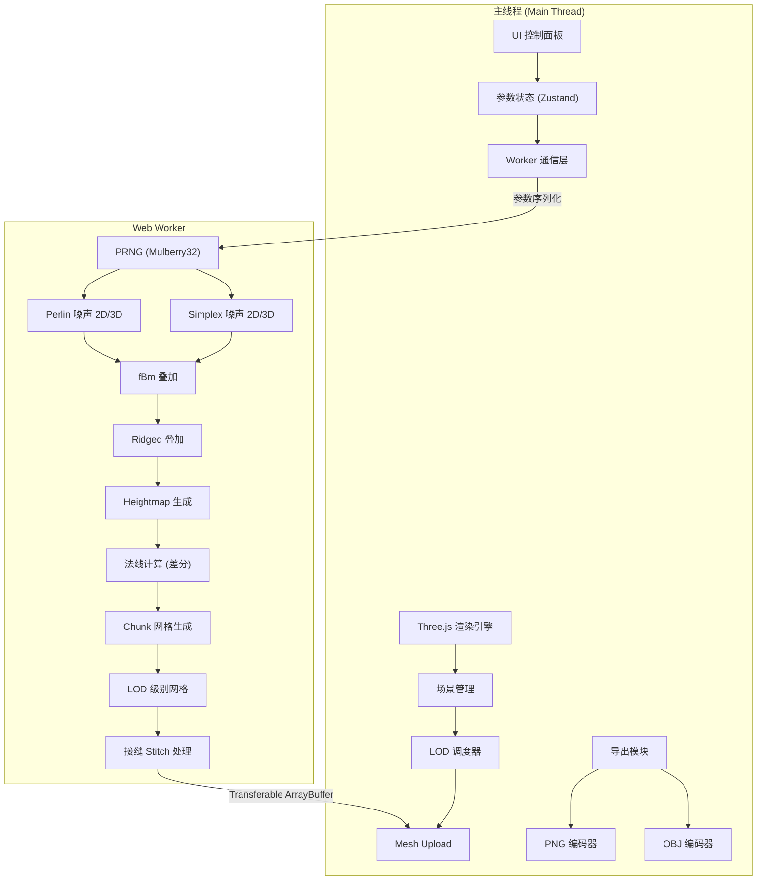

## 1. 架构设计



## 2. 技术说明

- **前端框架**：Three.js (r170+) + TypeScript + Vite
- **构建工具**：Vite 5.x（原生 Web Worker 支持）
- **状态管理**：Zustand（轻量参数状态）
- **UI 样式**：Tailwind CSS 3.x
- **测试**：Vitest（单元测试）+ jsdom
- **后端**：无（纯前端）
- **包管理**：pnpm

### 核心依赖

| 依赖 | 版本 | 用途 |
|------|------|------|
| three | ^0.170.0 | 3D 渲染引擎 |
| zustand | ^4.x | 参数状态管理 |
| tailwindcss | ^3.x | UI 样式 |
| vitest | ^2.x | 单元测试 |

**禁止使用**：simplex-noise、perlin-noise、noisejs 等噪声库（必须自实现）

## 3. 路由定义

单页应用，无路由切换。所有功能在同一页面：
- `/` — 地形生成器主界面

## 4. 模块架构

### 4.1 目录结构

```
src/
├── workers/
│   └── terrain.worker.ts      # Web Worker：噪声 + 网格生成
├── noise/
│   ├── prng.ts                # Mulberry32 确定性 PRNG
│   ├── perlin.ts              # 自实现 Perlin 噪声 2D/3D
│   ├── simplex.ts             # 自实现 Simplex 噪声 2D/3D
│   └── fbm.ts                 # fBm + Ridged 多层叠加
├── terrain/
│   ├── heightmap.ts           # heightmap 生成
│   ├── mesh.ts                # heightmap → 三角网格 + 法线
│   ├── lod.ts                 # LOD 分级 + 接缝处理
│   └── coloring.ts            # 高度+斜率分层着色
├── export/
│   ├── png-exporter.ts        # 16 位灰度 PNG 导出
│   └── obj-exporter.ts        # OBJ 模型导出
├── scene/
│   ├── renderer.ts            # Three.js 渲染器初始化
│   ├── camera.ts              # 相机 + OrbitControls
│   ├── lighting.ts            # 光照设置
│   └── terrain-mesh.ts        # 地形 Mesh 管理
├── ui/
│   ├── App.tsx                # 主应用组件
│   ├── ControlPanel.tsx       # 参数控制面板
│   ├── ExportPanel.tsx        # 导出面板
│   └── HUD.tsx                # FPS/统计 HUD
├── store/
│   └── terrain-store.ts       # Zustand 参数状态
├── types/
│   └── terrain.ts             # 类型定义
├── main.ts                    # 入口
└── style.css                  # 全局样式
```

### 4.2 核心算法设计

#### PRNG — Mulberry32

```
输入：种子 (uint32)
输出：[0, 1) 浮点数
算法：Mulberry32 — 单状态 32-bit PRNG，字节级确定性
```

#### Perlin 噪声 (2D/3D)

```
1. 根据种子生成排列表 (permutation table)，使用 PRNG shuffle
2. 输入坐标 → 整数网格点 + 小数部分
3. 5阶缓和曲线 (fade): 6t⁵ - 15t⁴ + 10t³
4. 梯度向量点积 → 三线性插值
5. 输出范围 [-1, 1]
```

#### Simplex 噪声 (2D/3D)

```
1. 共享 Perlin 的排列表
2. 单纯形网格投影 (skew/unskew)
3. 贡献顶点 (2D: 3个, 3D: 4个)
4. 径向衰减函数: max(0, 0.5 - x²-y²)⁴
5. 梯度哈希点积 → 加权求和
6. 输出范围 [-1, 1]
```

#### fBm (分形布朗运动)

```
for each octave:
  value += amplitude * noise(frequency * point)
  amplitude *= persistence
  frequency *= lacunarity
```

#### Ridged 多分形

```
for each octave:
  signal = 1.0 - abs(noise(frequency * point))
  signal *= signal  // 平方增强脊线
  value += signal * amplitude
  amplitude *= signal * persistence  // 权重受信号调制
  frequency *= lacunarity
```

#### 法线计算（差分采样）

```
对 heightmap 上点 (x, z):
  hL = height(x-1, z), hR = height(x+1, z)
  hD = height(x, z-1), hU = height(x, z+1)
  normal = normalize(cross(
    vec3(2, hR-hL, 0),
    vec3(0, hU-hD, 2)
  ))
```

#### LOD 系统

```
4 级 LOD：LOD0(全分辨率) → LOD3(1/8 分辨率)
距离阈值：near, mid, far
接缝处理：边界 vertex 共享 + stitch 策略
  - 相邻 chunk LOD 差 > 1 时，低分辨率侧添加退化三角形过渡
  - 边界顶点对齐到高分辨率侧的细分网格点
```

#### 着色分层

```
根据高度 h 和斜率 slope:
  h < waterLevel          → 水 (深蓝)
  h < waterLevel + beach  → 沙 (米黄)
  slope < grassSlope && h < snowLine → 草 (绿)
  slope >= grassSlope && h < snowLine → 岩 (灰)
  h >= snowLine           → 雪 (白)
  在阈值交界处线性插值混合
```

### 4.3 Web Worker 通信协议

**主线程 → Worker 消息：**

| 类型 | 字段 | 说明 |
|------|------|------|
| GENERATE_HEIGHTMAP | params: NoiseParams | 生成 heightmap |
| GENERATE_MESH | chunkCoords, lodLevel | 生成 chunk 网格 |
| EXPORT_HEIGHTMAP | params | 导出用 heightmap 数据 |

**Worker → 主线程 消息：**

| 类型 | 字段 | 说明 |
|------|------|------|
| HEIGHTMAP_READY | data: Float32Array, width, height | heightmap 数据 |
| MESH_READY | positions, normals, indices, lodLevel | 网格数据 (Transferable) |
| PROGRESS | percent | 进度百分比 |

### 4.4 数据类型定义

```typescript
interface NoiseParams {
  seed: number;
  amplitude: number;
  frequency: number;
  octaves: number;
  lacunarity: number;
  persistence: number;
  noiseType: 'perlin' | 'simplex';
  fractalType: 'fbm' | 'ridged';
}

interface TerrainParams {
  heightScale: number;
  waterLevel: number;
  chunkSize: number;
  worldSize: number;
  lodDistances: [number, number, number];
}

interface ChunkData {
  x: number;
  z: number;
  lodLevel: number;
  positions: Float32Array;
  normals: Float32Array;
  indices: Uint32Array;
}
```

## 5. 验证方案

### 5.1 确定性验证

- 固定 seed=42 + octaves=4 → 生成 heightmap PNG
- 计算 SHA256 → 与参考样本比对
- Mulberry32 PRNG：已知种子输出序列与参考匹配

### 5.2 噪声精度验证

- Perlin 2D/3D：已知坐标输出与 Ken Perlin 论文参考值比对（容差 1e-6）
- Simplex 2D/3D：整数坐标输出为 0（对称性验证）
- fBm 叠加：单八度输出 = 基础噪声输出

### 5.3 LOD 验证

- 切换距离阈值，远处 chunk 三角形数下降
- 视觉检查无裂缝
- 边界顶点坐标连续性验证

### 5.4 导出验证

- OBJ 文件用 Blender 打开，验证三角形数 + AABB
- PNG 16 位灰度正确编码，像素值范围 [0, 65535]

### 5.5 性能验证

- 4096×4096 heightmap 分片生成不卡主线程
- Web Worker 分片每片 512×512，进度回报
